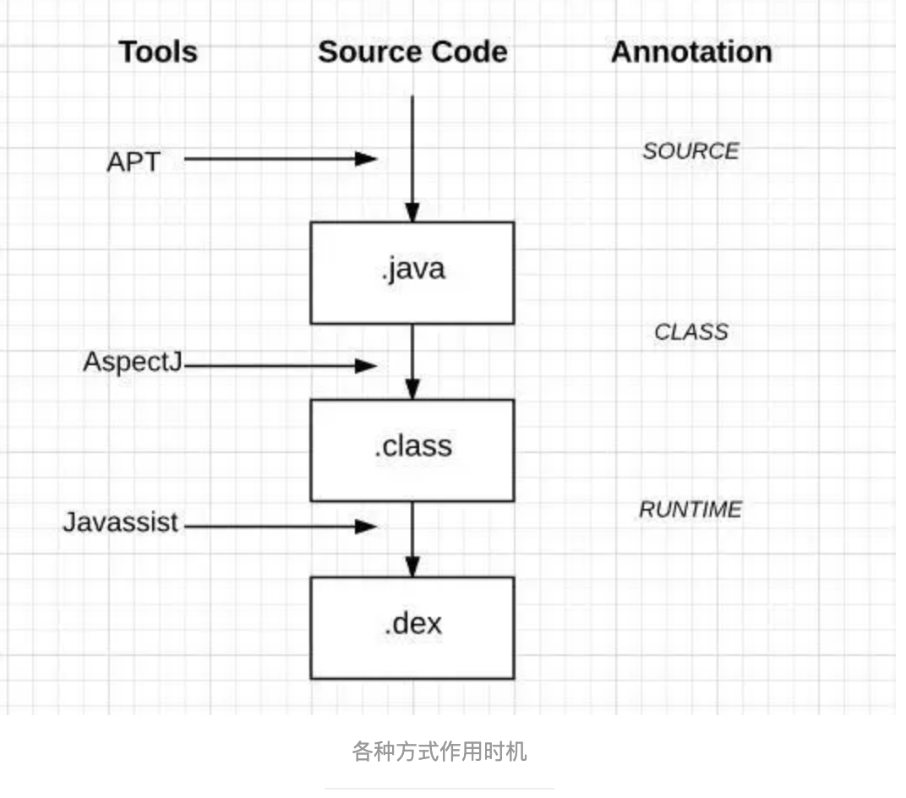

# ASM了解和学习
> 1.ASM是什么？
 2.ASM 跟传说中的AOP三剑客APT、aspectJ、Javassit有什么关系？
 3.ASM是怎样修改class文件的？

## 1.ASM是什么？

ASM 是一个 Java 字节码操控框架。它能被用来动态生成类或者增强既有类的功能。ASM 可以直接产生二进制 class 文件，也可以在类被加载入 Java 虚拟机之前动态改变类行为。Java class 被存储在严格格式定义的 .class 文件里，这些类文件拥有足够的元数据来解析类中的所有元素：类名称、方法、属性以及 Java 字节码（指令）。ASM 从类文件中读入信息后，能够改变类行为，分析类信息，甚至能够根据用户要求生成新类。说白了asm是直接通过字节码来修改class文件。

## 2.ASM 跟传说中的AOP三剑客APT、aspectJ、Javassit有什么关系？

分别解释下这几个名词

- APT:APT(Annotation Processing Tool)即注解处理器，是一种处理注解的工具，确切的说它是javac的一个工具，它用来在编译时扫描和处理注解。注解处理器以Java代码(或者编译过的字节码)作为输入，生成.java文件作为输出。简单来说就是在编译期，通过注解生成.java文件

- aspectJ:AspectJ是一个面向切面的框架，它扩展了Java语言。AspectJ定义了AOP语法，所以它有一个专门的[编译器]用来生成遵守Java字节编码规范的Class文件。适合在某一个方法前后插入部分代码，处理某些逻辑：比如方法运行时间、插入动态权限检查等。问题会造成很多的冗余代码，产生很多代理类。简单来说就是在生成class时动态织入代码

- Javassit: Javassist是一个开源的分析、编辑和创建Java字节码的类库。是由东京工业大学的数学和计算机科学系的 Shigeru Chiba(千叶滋)所创建的。简单来说就是源码级别的api去修改字节码

## 3.ASM是怎样修改class文件的？
开始这个问题之前我们要先了解一些知识
- 字节码(下面的文章讲解的不错)
  - [Java ByteCode](https://www.jianshu.com/p/92a75a18cbc1) 
  - [Java字节码指令](https://www.cnblogs.com/faunjoe88/p/8126464.html) 
  - [大话+图说：Java字节码指令——只为让你懂](https://segmentfault.com/a/1190000008606277) 
  - [从 HelloWorld 看 Java 字节码文件结构](https://cloud.tencent.com/developer/article/1096582) 
  - [Java字节码增强探秘](https://mp.weixin.qq.com/s/CH9D-E7fxuu462Q2S3t0AA)

- 访问者模式

> 一个称为元素（Element），另一个称为访问者（Visitor）。元素有一个accept方法，该方法接收访问者作为参数；accept()方法调用访问者的visit()方法，并且将元素自身作为参数传递给访问者。由元素本身决定是否访问

在ASM中元素（被访问者）ClassReader、MethodNode等等，访问者接口包含ClassVisitor、AnnotationVisitor、FieldVisitor、MethodVisitor

常用类说明
1. Opcodes接口定义了一些常量，尤其是版本号，访问标示符，字节码等信息；
2. ClassReader用于读取Class文件，主要用于Class文件的分析，可接受一个ClassVisitor;ClassReader会将解析过程中产生的类的部分信息，比如访问标识符，字段，方法逐个送入ClassVisitor,后者在接收到对应的信息后，进行各自的处理；
3. ClassVisitor的子类ClassWriter: 负责进行Class文件的输出和生成。ClassVisitor在进行字段和方法处理的时候，会委托给FieldVistor和MethodVisitor进行处理；在类的处理过程中，会创建对应的FieldVisitor和MethodVisitor对象；FieldVisitor和MethodVisitor类也各自有1个重要的子类，FieldWriter和MethodWriter；当ClassWriter进行字段和方法的处理时，也是依赖这两个类进行的;
4. ClassVisitor,FieldVisitor,MethodVisitor都可以使用委托的方式，将实际的处理工作交给内部的委托类进行；它们内部有一些列的visitXXX方法,这些方法就是ASM 的实际方法code。

[Android Transform + ASM 初探](https://www.jianshu.com/p/e8433c1eb581) 
[Android中Gradle插件和Transform](https://www.jianshu.com/p/49425d46ea4f)

总结：ASM直接修改class文件确实效率很高，但因直接操作字节码，需要有字节码知识，不适合直接上手，相比较来Javassit源码级修改class文件更方便些。

[javassist使用全解析](https://www.cnblogs.com/rickiyang/p/11336268.html) 
[秒懂Java动态编程（Javassist研究）](https://blog.csdn.net/ShuSheng0007/article/details/81269295) 
[javassist基础以及如何使用javassist实现AOP](https://blog.csdn.net/zhaocuit/article/details/83901410) 
[Javassist官方文档翻译](https://www.jianshu.com/p/423b35e6dc5d) 
[Javassist中文技术文档](https://www.cnblogs.com/scy251147/p/11100961.html)

## 需要使用的工具

- 1.查看字节码工具

如果每次查看反汇编的字节码都使用javap命令的话非常繁琐。有一个idea插件：jclasslib. 安装完成重启，代码编译后再菜单栏’view‘中选择”Show Bytecode With jclasslib“,可以很直观的看到当前字节码文件的类信息、常量池、方法区等信息。

- 2.ASM Bytecode Outline插件
插件安装完成后，在查看类右键点击 Show Bytecode outline

